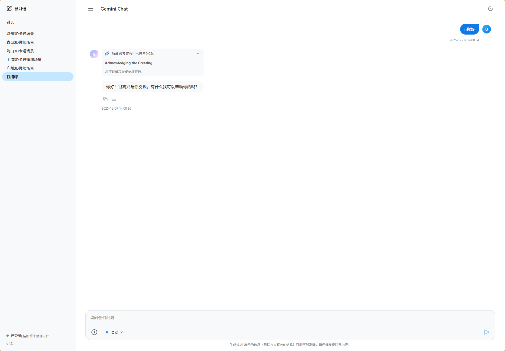
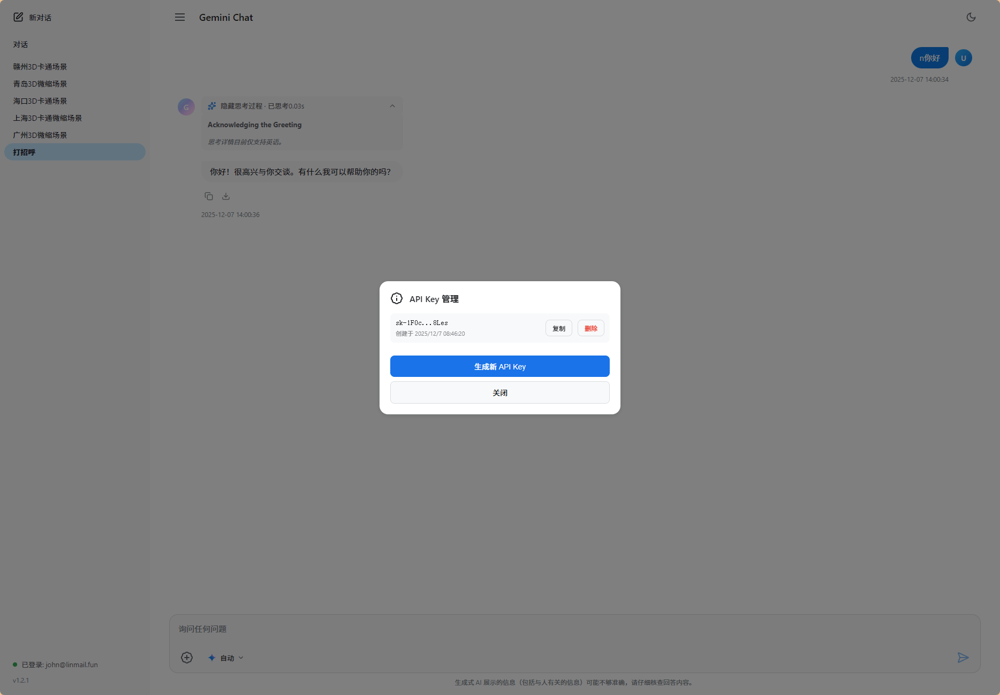
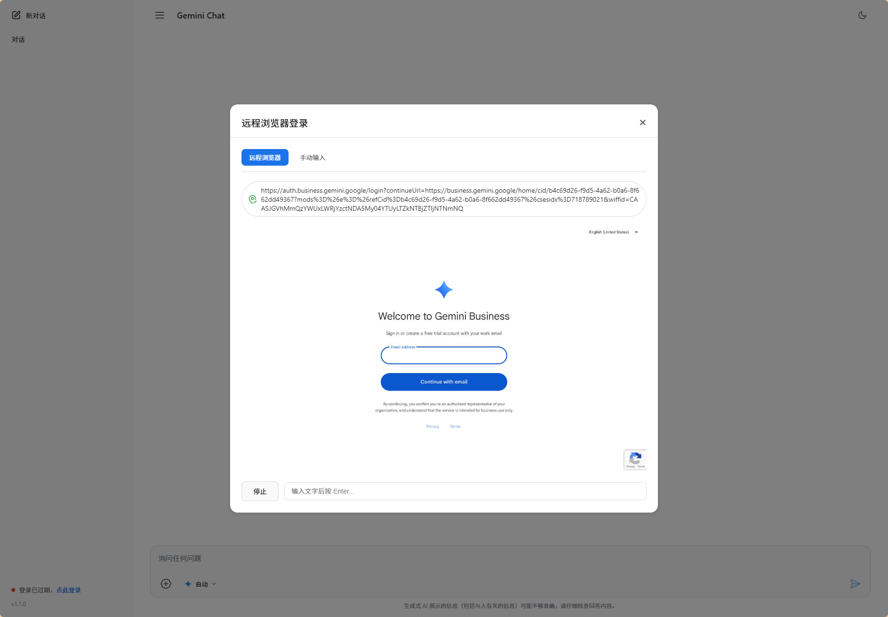

# Business Gemini API 服务

[](https://github.com/ccpopy/gemini-chat)
[](https://github.com/ccpopy/gemini-chat/fork)
[](https://github.com/ccpopy/gemini-chat/issues)
[](https://github.com/ccpopy/gemini-chat/blob/main/LICENSE)

生产级的 Google Business Gemini API 服务，提供 OpenAI 兼容的聊天接口和 Web 管理界面。

## 📸 界面预览

<div align="center">
  
### Web 聊天界面


### API Key 管理



### 远程浏览器登录



</div>

## 📑 目录

- [特性](#-特性)
- [快速开始](#-快速开始)
  - [环境准备](#1-环境准备)
  - [配置说明](#2-配置说明)
  - [登录](#3-登录)
  - [启动服务](#4-启动服务)
- [Docker 部署](#-docker-部署)
  - [使用 Docker Compose](#使用-docker-compose-推荐)
  - [手动 Docker 部署](#手动-docker-部署)
- [API 使用](#-api-使用)
  - [智能双模式验证](#智能双模式验证)
  - [OpenAI 兼容 API](#openai-兼容-api)
  - [API Key 管理](#api-key-管理)
  - [会话管理](#会话管理)
- [配置详解](#-配置详解)
  - [完整配置项](#完整配置项)
  - [环境变量](#环境变量)
  - [配置热重载](#配置热重载)
- [Web 界面](#-web-界面)
- [故障排除](#-故障排除)
- [生产部署](#-生产部署建议)
- [开发指南](#-开发模式)
- [许可证](#-许可证)

## ✨ 特性

### 核心功能

- ✅ **OpenAI 兼容 API** - 完全兼容 OpenAI Chat Completions API 格式
- ✅ **智能双模式验证** - 前端 Cookie 验证 + 第三方 API Key 验证
- ✅ **Web 管理界面** - 美观的聊天界面，支持图片生成和管理
- ✅ **多会话管理** - 支持多个独立对话会话，历史记录同步

### 安全与管理

- 🔒 **API Key 管理** - 可创建、查看、删除 API Key
- 🔐 **双重验证机制** - Cookie 优先，API Key 备用
- 🛡️ **防抓包攻击** - Cookie 绑定会话，无法简单复用

### 运维特性

- 📦 **Docker 支持** - 完整的容器化部署方案
- 🔄 **配置热重载** - 修改配置无需重启服务
- 🌐 **代理支持** - HTTP/SOCKS5/SOCKS5H 代理
- 📊 **健康检查** - 内置健康检查端点
- 📝 **详细日志** - 完整的访问和错误日志

### 兼容性

- 🔌 **第三方集成** - 支持 Cherry Studio、Lobe Chat、ChatWebUI 等
- 🖼️ **图片生成** - 支持 Gemini 图片生成和下载
- 🎯 **严格模式** - 提供严格 OpenAI 兼容端点

## 🚀 快速开始

### 1. 环境准备

```bash
# 克隆项目
git clone https://github.com/ccpopy/gemini-chat.git
cd gemini-chat

# 创建虚拟环境
python -m venv venv

# 激活虚拟环境
# Windows:
venv\Scripts\activate
# Linux/Mac:
source venv/bin/activate

# 安装依赖
pip install -r requirements.txt

# 安装 Playwright 浏览器（用于登录）
playwright install chromium chrome

# Linux 系统还需要安装系统依赖
playwright install-deps
```

### 2. 配置说明

复制配置模板并编辑：

```bash
cp config.example.json config.json
```

基础配置示例：

```json
{
  "server": {
    "host": "0.0.0.0",
    "port": 8000,
    "workers": 4,
    "log_level": "INFO",
    "reload": false
  },
  "proxy": {
    "enabled": true,
    "url": "socks5h://127.0.0.1:10808",
    "timeout": 30
  },
  "session": {
    "_comment": "登录后自动填充，无需手动配置"
  },
  "browser_keep_alive": {
    "enabled": false,
    "interval_minutes": 60,
    "headless": true
  },
  "remote_browser": {
    "headless": true
  },
  "security": {
    "admin_password": "",
    "require_api_key": false
  },
  "redis": {
    "enabled": false,
    "host": "127.0.0.1",
    "port": 6379,
    "password": "",
    "db": 0,
    "key_prefix": "gemini_chat:"
  }
}
```

详细配置说明请参见 [配置详解](#-配置详解) 部分。

### 3. 登录

首次使用需要登录 Google Business Gemini：

**命令行登录**：

```bash
python app.py login
```

**Web 界面登录**（推荐）：

1. 启动服务后访问 http://localhost:8000
2. 点击"登录"按钮
3. 在弹出的浏览器中完成 Google 登录
4. 登录成功后自动保存配置

### 4. 启动服务

#### Windows

```powershell
./manage.bat start          # 启动服务
./manage.bat status         # 查看状态
./manage.bat logs           # 查看日志
./manage.bat restart        # 重启服务
./manage.bat stop           # 停止服务
```

#### Linux/Mac

```bash
chmod +x manage.sh          # 赋予执行权限（首次）
./manage.sh start           # 启动服务
./manage.sh status          # 查看状态
./manage.sh logs            # 查看日志
./manage.sh reload          # 重载配置（不重启）
./manage.sh restart         # 重启服务
./manage.sh stop            # 停止服务
```

启动后访问：

- **Web 界面**: http://localhost:8000
- **API 端点**: http://localhost:8000/v1/chat/completions
- **API 文档**: http://localhost:8000/docs

## 🐳 Docker 部署

### 使用 Docker Compose（推荐）

1. **准备配置文件**

```bash
# 复制配置模板
cp config.example.json config.json

# 编辑配置（设置代理等）
vim config.json
```

2. **启动服务**

```bash
# 启动
docker-compose up -d

# 查看日志
docker-compose logs -f

# 停止
docker-compose down
```

3. **首次登录**

访问 http://localhost:8000，点击"登录"按钮，在弹出的远程浏览器中完成登录。

### 手动 Docker 部署

1. **构建镜像**

```bash
docker build -t gemini-chat .
```

2. **运行容器**

```bash
# 创建数据目录
mkdir -p data biz_gemini_images

# 运行容器
docker run -d \
  --name gemini-chat \
  -p 8000:8000 \
  --shm-size=1g \
  -v $(pwd)/data:/app/data \
  -v $(pwd)/biz_gemini_images:/app/biz_gemini_images \
  -v $(pwd)/config.json:/app/config.json:ro \
  -e TZ=Asia/Shanghai \
  gemini-chat
```

3. **查看日志**

```bash
docker logs -f gemini-chat
```

**重要提示**：

- `--shm-size=1g` 或 `--ipc=host` 可避免浏览器共享内存不足
- 数据目录和配置文件需要正确映射以实现持久化

## 📡 API 使用

### 智能双模式验证

本服务支持两种访问模式：

#### 🌐 前端网页访问（Cookie 验证）

- 无需 API Key
- 通过 Google 账号登录后自动验证
- 体验类似 Google Gemini 官方界面

#### 🔌 第三方客户端访问（API Key 验证）

- 需要提供 API Key
- 完全兼容 OpenAI API 标准
- 适用于 Cherry Studio、Lobe Chat 等客户端

**验证优先级**：Cookie > API Key

即使提供了 API Key，如果服务器检测到有效的 Cookie，会优先使用 Cookie 验证。

#### 启用 API Key 验证

编辑 `config.json`：

```json
{
  "security": {
    "admin_password": "your_admin_password",
    "require_api_key": true
  }
}
```

设置说明：

- `require_api_key: true` - 启用双模式验证
- **前端用户**：通过网页登录，无需 API Key
- **第三方客户端**：必须提供有效的 API Key

### OpenAI 兼容 API

#### 基础端点

```bash
POST /v1/chat/completions
```

**使用 API Key 调用**：

```bash
curl -X POST http://localhost:8000/v1/chat/completions \
  -H "Content-Type: application/json" \
  -H "Authorization: Bearer sk-your-api-key" \
  -d '{
    "model": "auto",
    "messages": [
      {"role": "user", "content": "你好，介绍一下你自己"}
    ],
    "stream": false
  }'
```

**保持会话上下文**：

```bash
# 使用 X-Session-Id header
curl -X POST http://localhost:8000/v1/chat/completions \
  -H "Content-Type: application/json" \
  -H "Authorization: Bearer sk-your-api-key" \
  -H "X-Session-Id: my-conversation-123" \
  -d '{
    "model": "auto",
    "messages": [{"role": "user", "content": "继续上次的对话"}]
  }'
```

会话 ID 优先级：`X-Session-Id` > `Conversation-Id` > `body.session_id` > 新建

#### 严格 OpenAI 兼容端点

适用于对协议有严格校验的第三方客户端（如 ChatWebUI、Lobe Chat）：

```bash
POST /v1/openai/chat/completions
```

特点：

- 响应仅包含标准 OpenAI 字段
- 会话信息通过响应头返回（`X-Session-Id`、`X-Session-Name`）
- 完全兼容 OpenAI API 规范

### API Key 管理

#### Web 界面管理

1. 访问 http://localhost:8000
2. 点击左下角状态指示器
3. 选择"获取 API Key"
4. 首次使用需设置管理密码
5. 创建、查看、删除 API Key

#### API 端点

```bash
# 检查是否已设置密码
GET /api/auth/has-password

# 验证/设置密码
POST /api/auth/verify-password
Content-Type: application/json
{"password": "your_password"}

# 获取 API Key 列表
GET /api/keys?password=your_password

# 生成新 API Key
POST /api/keys
Content-Type: application/json
{"password": "your_password", "name": "My Key", "permissions": ["chat"]}

# 获取完整 Key（用于复制）
GET /api/keys/{id}?password=your_password

# 删除 API Key
DELETE /api/keys/{id}?password=your_password
```

### 会话管理

```bash
# 列出所有会话
GET /api/sessions

# 创建新会话
POST /api/sessions

# 获取会话历史
GET /api/sessions/{id}/messages

# 删除会话
DELETE /api/sessions/{id}
```

### 其他端点

```bash
# 获取状态
GET /api/status

# 重载配置
POST /api/config/reload

# 健康检查
GET /health

# 获取版本信息
GET /api/version

# 列出模型
GET /v1/models
```

## ⚙️ 配置详解

### 完整配置项

```json
{
  "server": {
    "host": "0.0.0.0", // 监听地址
    "port": 8000, // 监听端口
    "workers": 4, // Worker 进程数（多进程模式）
    "log_level": "INFO", // 日志级别：DEBUG/INFO/WARNING/ERROR
    "reload": false // 开发模式自动重载
  },
  "proxy": {
    "enabled": true, // 是否启用代理
    "url": "socks5h://127.0.0.1:10808", // 代理地址（支持 http/socks5/socks5h）
    "timeout": 30 // 代理超时（秒）
  },
  "session": {
    // Gemini 会话配置 - 登录后自动填充
    "secure_c_ses": "", // Google Cookie
    "host_c_oses": "", // Google Cookie
    "nid": "", // Google Cookie
    "csesidx": "", // 会话索引
    "group_id": "", // 工作区 ID
    "project_id": "", // 项目 ID（用于图片下载）
    "cookies_saved_at": "", // Cookie 保存时间
    "cookie_raw": "", // 原始 Cookie
    "cookie_profile_dir": "" // 浏览器配置目录（用于复用会话）
  },
  "browser_keep_alive": {
    "enabled": false, // 是否启用浏览器保活（定期刷新 Cookie）
    "interval_minutes": 60, // 保活间隔（分钟）
    "headless": true // 是否无头模式
  },
  "remote_browser": {
    "headless": true // 远程登录浏览器是否无头模式
  },
  "security": {
    "admin_password": "", // 管理密码（用于 API Key 管理）
    "require_api_key": false // 是否要求第三方客户端使用 API Key
  },
  "redis": {
    "enabled": false, // 是否启用 Redis（多 worker 状态共享）
    "host": "127.0.0.1", // Redis 地址
    "port": 6379, // Redis 端口
    "password": "", // Redis 密码
    "db": 0, // Redis 数据库编号
    "key_prefix": "gemini_chat:" // Redis key 前缀
  }
}
```

### 环境变量

除了 `config.json`，还可以通过环境变量配置（优先级更高）：

```bash
# 服务器配置
export SERVER_HOST=0.0.0.0
export SERVER_PORT=8000
export SERVER_WORKERS=4
export SERVER_LOG_LEVEL=INFO

# 代理配置
export PROXY_URL=socks5h://127.0.0.1:10808

# 会话配置（通常由登录自动填充）
export BIZ_GEMINI_SECURE_C_SES=xxx
export BIZ_GEMINI_GROUP_ID=xxx

# 安全配置
export ADMIN_PASSWORD=your_password
export REQUIRE_API_KEY=true

# Redis 配置
export REDIS_ENABLED=true
export REDIS_HOST=127.0.0.1
export REDIS_PORT=6379
```

或使用 `.env` 文件：

```bash
cp .env.example .env
vim .env
```

### 配置热重载

服务支持配置热重载，修改 `config.json` 后会自动生效。

**自动重载**（推荐）：

- 保存文件后自动检测并重载
- 新配置在下次请求时生效

**手动重载**：

```bash
# Linux/Mac
./manage.sh reload

# Windows（需要重启）
manage.bat restart

# 或通过 API
curl -X POST http://localhost:8000/api/config/reload
```

## 🖥️ Web 界面

访问 http://localhost:8000 可以使用 Web 界面：

### 功能特性

- 💬 **聊天对话** - 类似 ChatGPT 的对话界面
- 📝 **多会话管理** - 创建、切换、删除多个对话
- 🎨 **Markdown 渲染** - 支持代码高亮、数学公式
- 🖼️ **图片生成** - Gemini 图片生成和查看
- 🌓 **深色模式** - 自动跟随系统或手动切换
- 📱 **响应式设计** - 支持桌面和移动设备
- 🔑 **API Key 管理** - Web 界面管理 API Key

### 远程浏览器登录

在无图形界面的服务器上：

1. 访问 Web 界面
2. 点击左下角状态指示器
3. 选择"远程浏览器"标签
4. 点击"启动浏览器"
5. 在页面中完成 Google 登录
6. 登录成功后点击"保存配置"

## 🔧 故障排除

### 1. 依赖安装问题

**SOCKS 代理依赖缺失**：

```bash
ERROR: Could not install packages due to an OSError: Missing dependencies for SOCKS support.
```

解决方法：

```bash
# 临时禁用代理安装
unset all_proxy ALL_PROXY http_proxy https_proxy
pip install pysocks
pip install -r requirements.txt
```

或使用国内镜像：

```bash
pip install -r requirements.txt -i https://pypi.tuna.tsinghua.edu.cn/simple
```

**Playwright 依赖安装**：

```bash
# 先安装系统依赖
playwright install-deps

# 再安装浏览器
playwright install chromium chrome

# 验证安装
python -c "from playwright.sync_api import sync_playwright; p = sync_playwright().start(); b = p.chromium.launch(); print('OK'); b.close(); p.stop()"
```

### 2. Cookie/Session 过期

Google Business Gemini 的 Cookie 大约 24 小时过期。

**重新登录**：

- Web 界面：点击"登录"按钮
- 命令行：`python app.py login`
- API：`POST /api/login/start`

### 3. 代理问题

如果代理导致连接问题，可以临时禁用：

```json
{
  "proxy": {
    "enabled": false
  }
}
```

### 4. Docker 浏览器问题

如果远程浏览器连接后立即断开，添加共享内存参数：

```bash
docker run --shm-size=1g ...
# 或
docker run --ipc=host ...
```

### 5. 多 Worker 状态不同步

如果使用多个 Worker（`workers > 1`），建议启用 Redis：

```json
{
  "redis": {
    "enabled": true,
    "host": "127.0.0.1",
    "port": 6379
  }
}
```

## 🏭 生产部署建议

### 1. 进程管理

**使用 systemd**（Linux）：

```bash
# 创建服务文件
sudo vim /etc/systemd/system/gemini-chat.service
```

```ini
[Unit]
Description=Gemini Chat Service
After=network.target

[Service]
Type=simple
User=your_user
WorkingDirectory=/path/to/gemini-chat
Environment="PATH=/path/to/gemini-chat/venv/bin"
ExecStart=/path/to/gemini-chat/venv/bin/python server.py
Restart=always

[Install]
WantedBy=multi-user.target
```

```bash
# 启用并启动
sudo systemctl enable gemini-chat
sudo systemctl start gemini-chat
sudo systemctl status gemini-chat
```

### 2. 反向代理

**Nginx 配置示例**：

```nginx
server {
    listen 80;
    server_name your-domain.com;

    location / {
        proxy_pass http://127.0.0.1:8000;
        proxy_set_header Host $host;
        proxy_set_header X-Real-IP $remote_addr;
        proxy_set_header X-Forwarded-For $proxy_add_x_forwarded_for;

        # WebSocket 支持
        proxy_http_version 1.1;
        proxy_set_header Upgrade $http_upgrade;
        proxy_set_header Connection "upgrade";
    }
}
```

### 3. SSL/TLS

```bash
# 使用 Certbot 申请证书
sudo certbot --nginx -d your-domain.com
```

### 4. 日志轮转

```bash
# 创建 logrotate 配置
sudo vim /etc/logrotate.d/gemini-chat
```

```
/path/to/gemini-chat/log/*.log {
    daily
    rotate 7
    compress
    delaycompress
    missingok
    notifempty
}
```

### 5. 监控

- 使用 Prometheus + Grafana 监控
- 配置健康检查：`GET /health`
- 设置告警规则

## 👨‍💻 开发模式

直接运行服务（用于开发和调试）：

```bash
# 方式 1：直接运行
python server.py

# 方式 2：使用 uvicorn（支持热重载）
uvicorn server:app --reload --host 0.0.0.0 --port 8000

# 方式 3：使用 Gunicorn
gunicorn server:app -w 4 -k uvicorn.workers.UvicornWorker --bind 0.0.0.0:8000
```

## 🌟 Star History

[](https://www.star-history.com/#ccpopy/gemini-chat&type=date&legend=top-left)

## 📄 许可证

MIT License

## 💬 支持

- 提交 Issue: https://github.com/ccpopy/gemini-chat/issues
- 查看文档: https://github.com/ccpopy/gemini-chat
- Star 项目支持我们 ⭐

---

**开发者**: [ccpopy](https://github.com/ccpopy)
